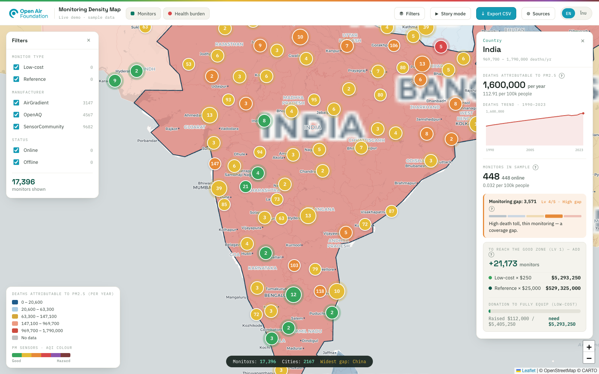

# Open Air Monitoring Gap

> Overlay **where air-quality monitors exist** on top of **where air pollution kills the most
> people** — so the *monitoring gap* is impossible to ignore. Built for the Open Air Foundation
> hackathon.

A full-stack, scalable web tool: an interactive world map shades each country by PM2.5-attributable
deaths and plots every public air-quality monitor, then shows — per country — how big the
monitoring gap is, how many monitors it would take to close it, and what that costs.



## Stack

Nuxt 3 + Leaflet (frontend) · NestJS + node-postgres + BullMQ (API) ·
PostgreSQL + PostGIS + TimescaleDB · Redis · Docker Compose.
See [`spec.md`](./spec.md) for the full system design and [`CLAUDE.md`](./CLAUDE.md) for conventions.

## Quick start

```bash
# one command — full stack
docker compose up --build
# web  → http://localhost:3000
# api  → http://localhost:3001/api/v1   (Swagger: /api/v1/docs)
```

Dev loop (infra in Docker, app servers local):

```bash
docker compose up -d postgres redis
npm --prefix apps/api install && npm --prefix apps/api run seed && npm --prefix apps/api run start:dev
npm --prefix apps/web install && npm --prefix apps/web run dev
```

## Features

Health-burden choropleth (PostGIS GeoJSON, `L.geoJSON`) · clustered AQI monitor pins ·
**per-monitor PM2.5 history** (TimescaleDB, on pin click) · per-country monitoring-gap level (1–5
quintile) · deaths trend 1990–2023 · monitors-needed + cost + donation maths · filters · story
mode · CSV export (4 datasets) · EN/TH.

## Data sources

Monitors — **live** from the [AirGradient Map API](https://map-data.airgradient.com/map/api/v1/docs)
(~17k public sensors worldwide, low-cost + reference; AirGradient / OpenAQ / SensorCommunity) ·
Deaths — [State of Global Air](https://www.stateofglobalair.org/data) (GBD/IHME) ·
Population — [UN WPP](https://population.un.org/wpp/) + World Bank.

Monitors are ingested live on startup and **auto-refreshed every 10 minutes by a BullMQ worker**
(`INGEST_ON_START` / `INGEST_SCHEDULE`), assigned to countries via PostGIS point-in-polygon; the
monitoring gap is then computed from **real monitor density × reference death burden**.
Deaths/population are seeded reference data (annual GBD/UN datasets — no live feed). If the API is
unreachable, the seeded sample is served instead.

## License

MIT
